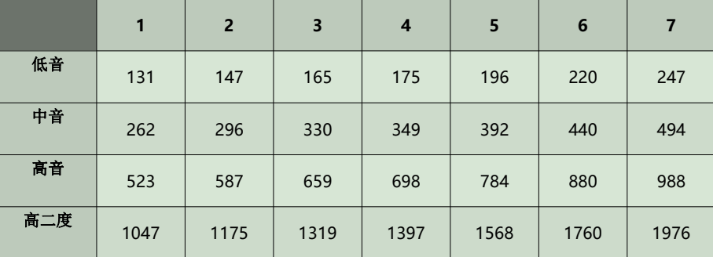
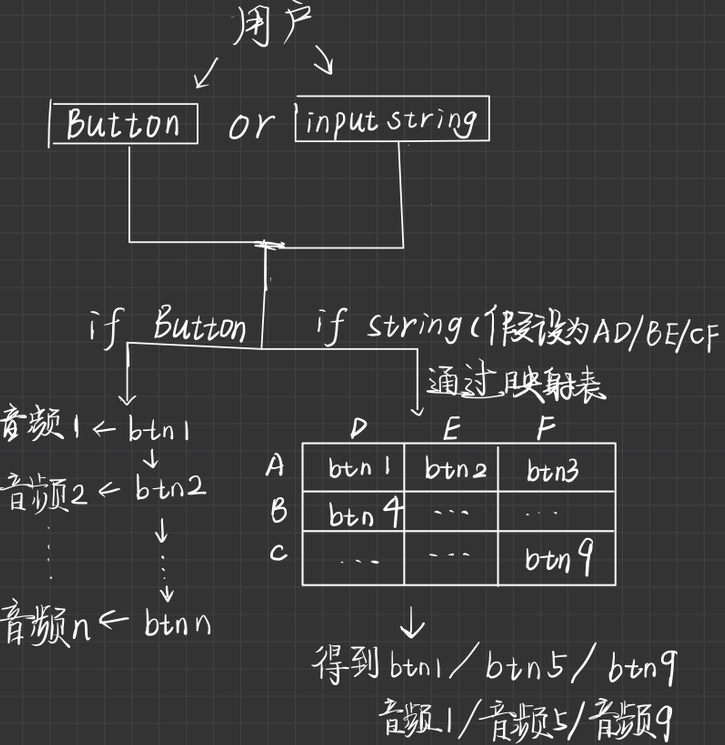

## 题目
### 已知各音阶标称频率值： （HZ）

### 完成一个程序，实现如下功能
#### (1)程序每间隔 0.5 秒扬声器发出不同频率的声音，每次升高 100HZ，直到频率达到2000hz。
#### (2)谱曲功能：首先给出基准节拍，并定义每个音节频率，输入一串字符串，可输出一段音乐。例如 0.5A1/1A2/0.5B3/1C4/5D1

## 概述

1. 任务（1）需要实现20个左右的音频文件依次播放，其中这些音频文件依次相差100Hz左右，任务（2）需要实现识别用户输入的字符串、将字符串编码以与音频文件一一对应的功能。需要的知识点：audio标签、模板字符串变量、js动态操作dom

2. 已实现所有任务。

3. 创新点：设计方案和演示效果集成在个人博客中，界面优雅简洁；琴键可视化，用户可以点击鼠标“弹琴”；健壮性较好，有错误提示，如输入字符串不合法等。

## 总体设计
1. 软件结构设计：针对任务（1）
2. 

### 思路
* 选定平台：浏览器，或者说node.js搭建的本地服务器
* 设计语言：html5、css3、javascript，以及vue框架
1. 先找到钢琴音频文件,我是在网上找到在线钢琴模拟器,自己录制声音然后剪辑，一共50个，实际使用了39个
::: tip
[在线钢琴模拟器](https://www.xiwnn.com/piano/)
 
录音软件用的是“金舟电脑录音软件”——显然听都没听说过:thumbsup:。虽然普通用户最久只能录制几分钟，但是我们就使用一下，完全ok，过后也可以马上卸载
 
音频剪辑软件我用的是audition（需破解，资源自己找吧）：

得到音频文件 
::: tip
全选然后重命名可以批量重命名这些文件
看着很多，其实一共**1.2MB**
实际我只选用了前38个音频文件
说实话，钢琴的音频文件还真不好找，不然我也不会用这种笨方法了:sob:
 
如果你有更好的解决办法，可以留言哦！:yum:
:::

2. 显然我们需要创建38个琴键，将琴键与音频文件一一绑定，实现点击琴键 -> 对应音频文件播放

### 任务（1） 
我的解决方案是用一个循环+延时，其中每个按键绑定的延时需要递增，否则就会出现所有按键几乎同时被点击，非常难受:cry:。
接着js控制按键依次被自动点击

### 任务（2）
我的解决方案是用一个输入框来存放用户输入的字符串变量，将该字符串转成数组，遍历数组依次判断本次循环中的数组元素应该对应哪个音频文件，遍历完后可以得到字符串与音频文件的对应关系，（期间你需要定义一个数组类型变量来记录播放顺序）然后遍历这个播放顺序的数组，依次让按钮自动被点击

### 源码
<RecoDemo :collapse="true">

  <template slot="code-template">
    <<< @/docs/.vuepress/components/piano.vue?template
  </template>
  <template slot="code-script">
    <<< @/docs/.vuepress/components/piano.vue?script
  </template>
  <template slot="code-style">
    <<< @/docs/.vuepress/components/piano.vue?style
  </template>
</RecoDemo>

### 改进空间:
由于音频标签audio本身的特性，音频短时间内不能被多次点击播放，导致相邻播放音频间延时要足够，否则当相邻播放音频为同一音源时只触发一次播放，不能完全模拟钢琴的效果
