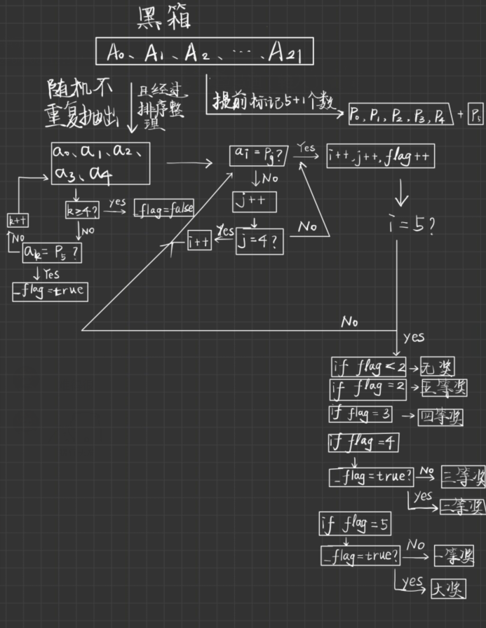

## 题目

1. 设兑奖方式为：从 1 到 22 选出 5 个不重复的数字{a0,a1,a2,a3,a4}，而主办方开出 5 个号码
   P0、P1、P2、P3、P4，外加一个特别号 P5，得奖方式如下：
   大奖：5 个号码和特别号码完全相同  
   一等奖：5 个号码完全相同，即{a0,a1,a2,a3,a4}={ P0，P1，P2，P3，P4}。  
   
   二等奖：{a0,a1,a2,a3,a4}中有 4 个号码出现在{ P0，P1，P2，P3，P4}，另一个号码等于 P5。  
   三得奖：{a0,a1,a2,a3,a4}中有 4 个号码出现在{ P0，P1，P2，P3，P4}，另一个号码不等于   P5。  
   四等奖：{a0,a1,a2,a3,a4}中有 3 个号码出现在{ P0，P1，P2，P3，P4}。  
   五等奖：{a0,a1,a2,a3,a4}中有 2 个号码出现在{ P0，P1，P2，P3，P4}。  
   问题是：根据投注情况，求出中奖的注。  

2. 基本要求
   （1） 设计投注的数据结构。  
   （2） 设计投注方式：键盘输入或从文件输入等。  
   （3） 设计求解中奖注的算法。  
   （4） 输出中奖注。  
   （5） 输入随机注，判断是否中奖，中几等奖。  

   基本思路：

