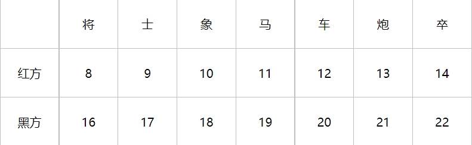
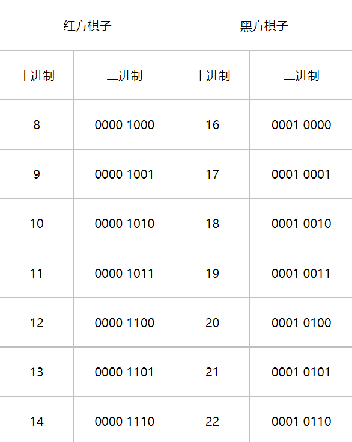
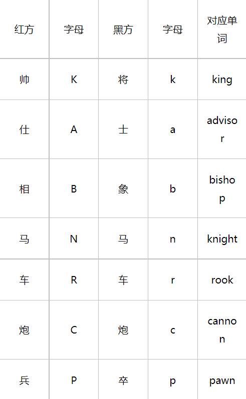
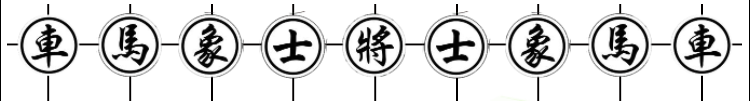

## 题目

自己设计一款类似围棋的棋类对战软件，不能用五子棋等已有规则。
要求：（1）可人人对战
（2）规则判断（提子、判断打劫）
（3）人机对战
（4）可点目（数子）判断胜负
（5）网络对战（选作）

## 页面设计

1. 棋盘表示
中国象棋有10行9列，很自然地想到可以用10×9矩阵表示棋盘。事实上，我们使用16×16矩阵来表示一个扩充了的虚拟棋盘。


如上图所示，灰色部分为真实棋盘，置于虚拟棋盘之中。这么做是因为可以快速判断棋子是否走出边界，以及便于之后的一些运算。

容易想到使用二维数组表示16×16矩阵，这样棋盘上的一个位置需要两个变量表示。如果使用长度为256的一维数组表示，一个位置只需一个变量，这就可以减少计算量。因此用一维数组表示16×16矩阵。

一维矩阵和二维矩阵之间的转换已经有现成算法，如下：

```javascript
RANK_Y(sq) {// 根据一维矩阵，获取二维矩阵行数 行数从0开始
      return sq >> 4;
},
FILE_X(sq) {// 根据一维矩阵，获取二维矩阵列数 列数从0开始
      return sq & 15;
},
```

判断某位置是否在棋盘内：

```js
IN_BOARD(sq) {
      return this.IN_BOARD_[sq] != 0;
}
```


2. 棋子表示

   使用整数表示棋子

   

这样可以快速判断某棋子属于红方还是黑方，如下表所示：



可以看出：

红方棋子 & 8 = 1

黑方棋子 & 16 = 1


3. 字符串表示局面

   我们可以用一行字符串表示一个局面，这就是FEN格式串，一种使用ASCII码字符描述国际象棋局面的标准，当然也可应用于中国象棋。中国象棋的初始局面可表示为：

   rnbakabnr/9/1c5c1/p1p1p1p1p/9/9/P1P1P1P1P/1C5C1/9/RNBAKABNR w - - 0 1

   

中国象棋共有十行，每行都用一个字符串表示，行间使用正斜杠分割。

例如：

* rnbakabnr表示

* 9表示：第二行都是空格。

* w表示轮到哪一方走，w即白方，b即黑方（没有用r表示红方，是为了与国际象棋对应，毕竟国际象棋是黑白两色。）

* "- -"，在中国象棋中没有意义，始终用“-”表示。

* 末尾的“0”表示双方没有吃子的走棋步数(半回合数)，通常该值达到120就要判和(六十回合自然限着)，一旦形成局面的上一步是吃子，这里就标记“0”。

* 末尾的“1”表示当前的回合数。

  使用FEN串初始化棋局，这就涉及到了将FEN串转化为一维棋局数组。暂时不考虑哪方走子，只解析红色部分，伪代码如下：

  ```javascript
  // 将FEN串转为一维数组
  行变量 y = 3
  列变量 x = 3
  var c = FEN串第一个字符;
  while (c != " ") {
    if (c == "/") {   // 换行
      x = 3;
      y ++;
      if (y > 12) {
        break;
      }
    } else if (c >= "1" && c <= "9") {  // 出现空位
      列向量x增加c
    } else if (c >= "A" && c <= "Z") {  // 红方棋子
      将字符表示的棋子转换为整数，并放入数组x + (y << 4)的位置
    } else if (c >= "a" && c <= "z") {
      将字符表示的棋子转换为整数，并放入数组x + (y << 4)的位置
    }
     
    c = FEN串的下一个字符;
  }
  ```

  

4. 棋盘界面设计

   

   由于棋盘有90个交叉点，我们把棋盘划分为的90个小正方形区域，交叉点是小正方形的中心。每个区域都会定义一个img标签。

   这些img标签有两个作用：

   * 显示棋子图片

     如果某个区域存在棋子，就会显示相应的棋子图片；否则，显示一张透明图片

   * 响应点击事件
   
     每个img标签都会绑定onmousedown事件。点击不同的img标签时，会传递不同的参数给响应函数，这样就知道点击的具体是哪个区域了。
