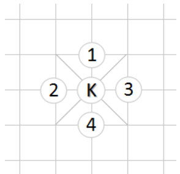

## 这一节介绍棋子的走法

## 走法表示
一个走法包括起点和终点，分别用sqSrc和pcDst表示一维棋局数组中的起点和终点。很容易想到，使用数组[sqSrc, pcDst]表示一个走法。但程序将来会处理大量的走法，使用数组表示走法太浪费内存。由于sqSrc和pcDst都是不超过255的整数（因为一维棋盘数组的大小是256），可以将sqSrc和pcDst压缩到一个整数中，算法如下：

```vue
MOVE(sqSrc, sqDst) {// 获取走法的起点
  return sqSrc + (sqDst << 8);
}
```

```vue
DST(mv) {// 获取走法的终点
  return mv >> 8;
}
```

1. 将的走法有四个方向，如下图所示：



在一维数组中，1、2、3、4几个方向的起点和终点分别满足以下等式：

pcDst = sqSrc - 16

pcDst = sqSrc - 1

pcDst = sqSrc + 1

pcDst = sqSrc + 16

且必须在九宫格内

2. 士的走法也是四个方向，如下所示

   

士的4个方向分别满足以下等式：

pcDst = sqSrc - 17

pcDst = sqSrc - 15

pcDst = sqSrc + 15

pcDst = sqSrc + 17

且终点sqSrc位于九宫内

3. 象的四个走法如下图所示，黑三角是相应的象眼位置

   

象的4个方向分别满足以下等式：

pcDst = sqSrc - 34

pcDst = sqSrc - 30

pcDst = sqSrc + 30

pcDst = sqSrc + 34

1) 象不能过河

在程序中，棋局被表示为大小为256的一维数组，一半棋盘位于0到127，另一半位于128到255。

128的二进制是1000 0000，右起第八位是1。128到255这些数的二进制，右起第8位都是1；0到127这些数的二进制，右起第8位都是0。因此，如果象没过河，也就是pcDst和sqSrc位于相同的一半棋盘，那么

2）象眼无棋子

象眼位于sqSrc和sqDst的中点，判断(sqSrc + sqDst)/2 的位置是否有棋子即可。