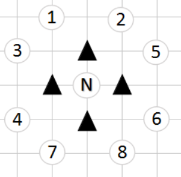
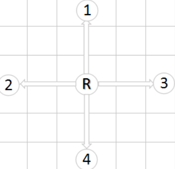
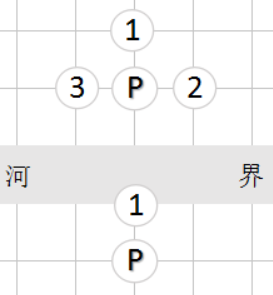

## 这一节介绍棋子的走法

## 走法表示
一个走法包括起点和终点，分别用sqSrc和pcDst表示一维棋局数组中的起点和终点。很容易想到，使用数组[sqSrc, pcDst]表示一个走法。（我不考虑节省内存）

::: tip

如果想节省内存，由于sqSrc和pcDst都是不超过255的整数（因为一维棋盘数组的大小是256），可以将sqSrc和pcDst压缩到一个整数中，算法如下：

```js
// 获取走法的起点
function SRC(mv) {
  return mv & 255;
}
// 获取走法的终点
function DST(mv) {
  return mv >> 8;
}
```

:::


### 将
将的走法有四个方向，如下图所示：


在一维数组中，1、2、3、4几个方向的起点和终点分别满足以下等式：

```js
pcDst = sqSrc - 16

pcDst = sqSrc - 1

pcDst = sqSrc + 1

pcDst = sqSrc + 16
```

且必须在九宫格内

### 士

士的走法也是四个方向，如下所示


   

士的4个方向分别满足以下等式：

```js
pcDst = sqSrc - 17

pcDst = sqSrc - 15

pcDst = sqSrc + 15

pcDst = sqSrc + 17
```


且终点sqSrc位于九宫内

### 象
象的四个走法如下图所示，黑三角是相应的象眼位置

   

象的4个方向分别满足以下等式：

```js
pcDst = sqSrc - 34

pcDst = sqSrc - 30

pcDst = sqSrc + 30

pcDst = sqSrc + 34
```


1) 象不能过河

在程序中，棋局被表示为大小为256的一维数组，一半棋盘位于0到127，另一半位于128到255。

128的二进制是1000 0000，右起第八位是1。128到255这些数的二进制，右起第8位都是1；0到127这些数的二进制，右起第8位都是0。因此，如果象没过河，也就是pcDst和sqSrc位于相同的一半棋盘，那么

2）象眼无棋子

象眼位于sqSrc和sqDst的中点，判断(sqSrc + sqDst)/2 的位置是否有棋子即可。

### 马

马的8个走法如下图所示，黑三角是相应的马脚位置



马的8个方向满足以下等式：

```js
pcDst = sqSrc - 33
pcDst = sqSrc - 31
pcDst = sqSrc - 18
pcDst = sqSrc + 14
pcDst = sqSrc - 14
pcDst = sqSrc + 18
pcDst = sqSrc + 31
pcDst = sqSrc + 33
```

对应的马脚分别位于：

```js
sqSrc - 16
sqSrc - 16
sqSrc - 1
sqSrc - 1
sqSrc + 1
sqSrc + 1
sqSrc + 16
sqSrc + 16
```

马的走法需要满足下面两个条件：

（1）、pcDst - sqSrc等于-33、-31、-18、14、-14、18、31、33其中的一个

（2）、对应马脚的位置没有棋子

我们使用一个新的辅助数组，来判断马的走法是否合法。


```js
var KNIGHT_PIN_ = [
                              0,  0,  0,  0,  0,  0,  0,  0,  0,
  0,  0,  0,  0,  0,  0,  0,  0,  0,  0,  0,  0,  0,  0,  0,  0,
  0,  0,  0,  0,  0,  0,  0,  0,  0,  0,  0,  0,  0,  0,  0,  0,
  0,  0,  0,  0,  0,  0,  0,  0,  0,  0,  0,  0,  0,  0,  0,  0,
  0,  0,  0,  0,  0,  0,  0,  0,  0,  0,  0,  0,  0,  0,  0,  0,
  0,  0,  0,  0,  0,  0,  0,  0,  0,  0,  0,  0,  0,  0,  0,  0,
  0,  0,  0,  0,  0,  0,  0,  0,  0,  0,  0,  0,  0,  0,  0,  0,
  0,  0,  0,  0,  0,  0,  0,  0,  0,  0,  0,  0,  0,  0,  0,  0,
  0,  0,  0,  0,  0,  0,  0,  0,  0,  0,  0,  0,  0,  0,  0,  0,
  0,  0,  0,  0,  0,  0,  0,  0,  0,  0,  0,  0,  0,  0,  0,  0,
  0,  0,  0,  0,  0,  0,  0,  0,  0,  0,  0,  0,  0,  0,  0,  0,
  0,  0,  0,  0,  0,  0,  0,  0,  0,  0,  0,  0,  0,  0,  0,  0,
  0,  0,  0,  0,  0,  0,  0,  0,  0,  0,  0,  0,  0,  0,  0,  0,
  0,  0,  0,  0,  0,  0,  0,  0,  0,  0,  0,  0,  0,  0,  0,  0,
  0,  0,  0,  0,  0,  0,-16,  0,-16,  0,  0,  0,  0,  0,  0,  0,
  0,  0,  0,  0,  0, -1,  0,  0,  0,  1,  0,  0,  0,  0,  0,  0,
  0,  0,  0,  0,  0,  0,  0,  0,  0,  0,  0,  0,  0,  0,  0,  0,
  0,  0,  0,  0,  0, -1,  0,  0,  0,  1,  0,  0,  0,  0,  0,  0,
  0,  0,  0,  0,  0,  0, 16,  0, 16,  0,  0,  0,  0,  0,  0,  0,
  0,  0,  0,  0,  0,  0,  0,  0,  0,  0,  0,  0,  0,  0,  0,  0,
  0,  0,  0,  0,  0,  0,  0,  0,  0,  0,  0,  0,  0,  0,  0,  0,
  0,  0,  0,  0,  0,  0,  0,  0,  0,  0,  0,  0,  0,  0,  0,  0,
  0,  0,  0,  0,  0,  0,  0,  0,  0,  0,  0,  0,  0,  0,  0,  0,
  0,  0,  0,  0,  0,  0,  0,  0,  0,  0,  0,  0,  0,  0,  0,  0,
  0,  0,  0,  0,  0,  0,  0,  0,  0,  0,  0,  0,  0,  0,  0,  0,
  0,  0,  0,  0,  0,  0,  0,  0,  0,  0,  0,  0,  0,  0,  0,  0,
  0,  0,  0,  0,  0,  0,  0,  0,  0,  0,  0,  0,  0,  0,  0,  0,
  0,  0,  0,  0,  0,  0,  0,  0,  0,  0,  0,  0,  0,  0,  0,  0,
  0,  0,  0,  0,  0,  0,  0,  0,  0,  0,  0,  0,  0,  0,  0,  0,
  0,  0,  0,  0,  0,  0,  0,  0,  0,  0,  0,  0,  0,  0,  0,  0,
  0,  0,  0,  0,  0,  0,  0,  0,  0,  0,  0,  0,  0,  0,  0,  0,
  0,  0,  0,  0,  0,  0,  0,  0,  0,  0,  0,  0,  0,  0,  0,  0,
  0,  0,  0,  0,  0,  0,  0,
];
```

该数组在（-33 + 256）、（-31 + 256）、（-18 + 256）、（14 + 256）、（-14 + 256）、（18 + 256）、（31 + 256）、（33 + 256）这8个位置分别存放了-1、-1、-16、-16、1、1、16、16，其他位置都是0。

设置变量sqPin满足：

```js
sqPin = sqSrc + KNIGHT_PIN_[sqDst - sqSrc + 256]
```

如果马的走法满足条件（1），那么spPin就是马脚的位置；否则sqPin = sqSrc。

因此马的走法合法，只需要满足sqPin != sqSrc并且sqPin位置无棋子。

### 车、炮

车的走法如下图所示：



沿着四条直线走，每个方向可一直向前走，直到：

（1）、走出棋盘

（2）、碰到本方棋子

（3）、吃掉对方棋子

例如方向1，每走一步都是在起点基础上-1；方向2是在起点基础上-16；方向3是在起点基础上+1；方向4是在起点基础上+16。

炮与车的行棋规则类似，也可以沿一个方向一直向前走，不过遇到棋子时，要越过去（也就是翻山）。翻山后，炮只能吃对方棋子，不能落到空位置。

具体校验算法可参看代码。

### 卒（兵）的走法

红兵的走法如下图所示：



（1）、判断是否过河

以红方为例，红方是向上走。如果红方过河，则会走到棋盘0到127的位置，此时所处位置的二进制表示，右起第8位是0。（因为128的二进制是1000 0000，这与之前讲过的SAME_HALF函数类似）

判断函数如下：

```js
// sp是棋子位置，sd是走棋方（红方0，黑方1）。如果该位置已过河，则返回true；否则返回false。
function AWAY_HALF(sq, sd) {
  return (sq & 0x80) == (sd << 7);
 
}
```

如果兵已经过河，是可以左右走的，满足下面条件的走法一定合法：

AWAY_HALF(sq, sd) && (sqDst == sqSrc - 1 || sqDst == sqSrc + 1)

（2）、判断兵（卒）是否是向前走了一步

红兵向前走一步是sqSrc - 16，黑卒向前走一步是sqSrc + 16。可用如下函数得到兵（卒）向前一步的位置：

```js
// sp是棋子位置，sd是走棋方（红方0，黑方1）。返回兵（卒）向前走一步的位置。
function SQUARE_FORWARD(sq, sd) {
  return sq - 16 + (sd << 5);
}
```

因此，只要sqDst = = SQUARE_FORWARD(sq, sd)，说明兵（卒）是向前走了一步，走法合法。