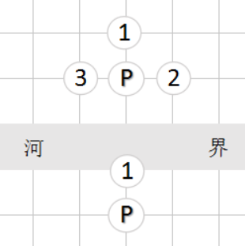

## 走法生成

### 将（帅）


使用一个辅助数组表示这四个方向：  

<code>let KING_DELTA = [-16, -1, 1, 16];</code>  

已知帅在一维棋局数组中的起点位置sqSrc。生成帅的走法，就是获取帅全部的合法终点sqDes。使用一个数组存储所有可能的走法，伪代码如下：

```javascript
for (var i = 0; i < 4; i ++) {       // 将的4个方向
  let sqDst = sqSrc + KING_DELTA[i];    // 得到一个可能的终点位置
  if (该位置不位于九宫中) {
    // 该走法不合法，执行下一轮循环
    continue;
  }
  var pcDst = 终点位置的棋子;  　　　　// 如果终点位置没有棋子，那么pcDst=0
  if (pcDst不是本方棋子) {
    走法合法，保存到步骤数组中
  }
}
```

### 仕


同样使用辅助数组表示仕的4个方向：  

<code>let ADVISOR_DELTA = [-17, -15, 15, 17];</code>

生成仕的走法，伪代码如下：

```js
for (var i = 0; i < 4; i ++) {　　　　　　// 仕的4个方向
  var sqDst = sqSrc + ADVISOR_DELTA[i]; // 得到一个可能的终点位置
  if (该位置不位于九宫中) {
    // 该走法不合法，执行下一轮循环
    continue;
  }
  var pcDst = 终点棋子;　　　　　　　　　　// 如果终点位置没有棋子，那么pcDst=0
  if (pcDst不是本方棋子) {
    走法合法，保存到步骤数组中
  }
}
```

### 象


我们并不用设置一个类似[-34, -30, 30, 37]的数组保存象的方向。因为仕的方向，跟象眼的方向一致。仕方向的二倍，就是象的方向。

```js
for (var i = 0; i < 4; i ++) {       // 象的4个方向
  var sqDst = sqSrc + ADVISOR_DELTA[i]; // 获得象眼的位置
  if (象眼不在棋盘上，或者象眼位置已过河，或者象眼存在棋子) {
        // 位置不合法，执行下一轮循环
    continue;
  }
  sqDst += ADVISOR_DELTA[i];    　　　　// 得到一个可能的终点位置
  var pcDst = 终点位置的棋子   　　　　// 如果终点位置没有棋子，那么pcDst=0
  if (pcDst不是本方棋子) {
    走法合法，保存到步骤数组中
  }
}
```

### 马


用辅助数组表示马的方向：

KNIGHT_DELTA = [[-33, -31], [-18, 14], [-14, 18], [31, 33]];

对应马腿的4个方向，与帅的4个方向是一样的。

生成马的走法，伪代码如下：

```js
for (var i = 0; i < 4; i ++) {　　　　　　// 马腿的4个方向
  var sqDst = sqSrc + KING_DELTA[i];　　// 得到一个马腿的位置
  if (马腿位置存在棋子) {
    continue;
  }
  for (var j = 0; j < 2; j ++) { // 1个马腿对应2个马的方向
    sqDst = sqSrc + KNIGHT_DELTA[i][j]; // 得到一个马的可能的终点位置
    if (该位置不在棋盘上) {
      continue;
    }
    var pcDst = 终点位置的棋子;        // 如果终点位置没有棋子，那么pcDst=0
    if (pcDst不是本方棋子) {
      走法合法，保存到步骤数组中
    }
  }
}
```

### 车


车的方向与帅的方向相同，只不过车可以连续走下去。

生成车的走法，伪代码如下：

```js
for (var i = 0; i < 4; i ++) {
  var delta = KING_DELTA[i];    // 得到一个方向
  var sqDst = sqSrc + delta;    // 从起点sqSrc开始，沿着方向delta走一步
  while (sqDst在棋盘上) {
    var pcDst = sqDst位置的棋子;
    if (pcDst == 0) {       // sqDst位置上根本就没有棋子
      走法合法，保存到步骤数组中
    } else {
      if (pcDst是对方的棋子) {
        走法合法，保存到步骤数组中
      }
      // 已经遇到了对方棋子，终止循环
      break;
    }
    sqDst += delta;     // 沿着方向delta向前走一步
  }
}
```

### 炮


炮的走法与车类似，但炮遇到一个棋子后，可以越过去，也就是翻山，并吃掉一个对方棋子。

生成炮的走法，伪代码如下：

```js
for (var i = 0; i < 4; i ++) {
  var delta = KING_DELTA[i];    // 得到一个方向
  var sqDst = sqSrc + delta;    // 从起点sqSrc开始，沿着方向delta走一步
  while (sqDst在棋盘上) {
    var pcDst = sqDst位置的棋子;
    if (pcDst == 0) {       // sqDst位置上根本就没有棋子
      走法合法，保存到步骤数组中
    } else {            // 终点存在棋子，炮需要翻山
      break;
    }
    sqDst += delta;     // 沿着方向delta向前走一步
  }
  sqDst += delta;       // 沿着方向delta向前走一步
  while (IN_BOARD(sqDst)) { // 如果sqDst仍位于棋盘，那么此时炮已经翻山了
    var pcDst = sqDst位置的棋子;
    if (pcDst > 0) {     // 炮翻山后遇到了一个棋子
      if (pcDst是对方棋子) {
        走法合法，保存到步骤数组中
      }
      // 炮翻山后，不管遇到的是对方棋子，还是己方棋子，都要结束对当前方向的搜索
      break;
    }
    sqDst += delta;
  }
}
```

### 兵



红兵和黑卒向前走的方向是不一样的，分别是-16和16。我们已经介绍了下面的函数：

```js
// sp是棋子位置，sd是走棋方（红方0，黑方1）。返回兵（卒）向前走一步的位置。
function SQUARE_FORWARD(sq, sd) {
  return sq - 16 + (sd << 5);
}
```

该函数可以获得兵（卒）前进一步的位置。

生成兵的走法，伪代码如下：

```js
var sqDst = SQUARE_FORWARD(sqSrc, this.sdPlayer);   // 得到兵（卒）前进一步的位置
if (sqDst在棋盘上) {
  var pcDst = sqDst位置的棋子;
  if (pcDst不是本方棋子) {
    走法合法，保存到步骤数组中
  }
}
if (这个兵（卒）已过河) {
  for (var delta = -1; delta <= 1; delta += 2) {
    // delta只能取-1和1两个值，这正是兵（卒）的左右两个方向
    sqDst = sqSrc + delta;
    if (sqDst在棋盘上) {
      var pcDst = sqDst位置的棋子;
      if (pcDst不是本方棋子) {
        走法合法，保存到步骤数组中
      }
    }
  }
}
```


## 局面评估

局面评估，就是判断局面对红方（或黑方）的优势，并把优势量化。棋子价值可用以下不等式表达：

帅 > 车 > 马、炮 > 仕、相 > 兵

棋子价值可以简单量化为：

|  兵  |  仕  |  相  |  炮  |  马  |  车  |  帅  |
| :--: | :--: | :--: | :--: | :--: | :--: | :--: |
|  10  |  20  |  20  |  40  |  45  |  90  | 1000 |

但是棋子价值是跟位置有关系的，比如兵在过河前价值很小，过河后价值大涨。在我们的程序中，兵的位置价值数组如下：

```js
[   // 兵
    0,  0,  0,  0,  0,  0,  0,  0,  0,  0,  0,  0,  0,  0,  0,  0,
    0,  0,  0,  0,  0,  0,  0,  0,  0,  0,  0,  0,  0,  0,  0,  0,
    0,  0,  0,  0,  0,  0,  0,  0,  0,  0,  0,  0,  0,  0,  0,  0,
    0,  0,  0,  9,  9,  9, 11, 13, 11,  9,  9,  9,  0,  0,  0,  0,
    0,  0,  0, 19, 24, 34, 42, 44, 42, 34, 24, 19,  0,  0,  0,  0,
    0,  0,  0, 19, 24, 32, 37, 37, 37, 32, 24, 19,  0,  0,  0,  0,
    0,  0,  0, 19, 23, 27, 29, 30, 29, 27, 23, 19,  0,  0,  0,  0,
    0,  0,  0, 14, 18, 20, 27, 29, 27, 20, 18, 14,  0,  0,  0,  0,
    0,  0,  0,  7,  0, 13,  0, 16,  0, 13,  0,  7,  0,  0,  0,  0,
    0,  0,  0,  7,  0,  7,  0, 15,  0,  7,  0,  7,  0,  0,  0,  0,
    0,  0,  0,  0,  0,  0,  0,  0,  0,  0,  0,  0,  0,  0,  0,  0,
    0,  0,  0,  0,  0,  0,  0,  0,  0,  0,  0,  0,  0,  0,  0,  0,
    0,  0,  0,  0,  0,  0,  0,  0,  0,  0,  0,  0,  0,  0,  0,  0,
    0,  0,  0,  0,  0,  0,  0,  0,  0,  0,  0,  0,  0,  0,  0,  0,
    0,  0,  0,  0,  0,  0,  0,  0,  0,  0,  0,  0,  0,  0,  0,  0,
    0,  0,  0,  0,  0,  0,  0,  0,  0,  0,  0,  0,  0,  0,  0,  0,
]
```

在初始位置，中兵价值15，其他四个位置价值都是7。位于九宫的中心位置时，价值达到最高的44。这个数组肯定不是凭空想象出来的，应该是象棋百科全书网的前辈，经过无数次的试验得到的。

帅的位置价值数组如下：

```js
[   // 帅
    0,  0,  0,  0,  0,  0,  0,  0,  0,  0,  0,  0,  0,  0,  0,  0,
    0,  0,  0,  0,  0,  0,  0,  0,  0,  0,  0,  0,  0,  0,  0,  0,
    0,  0,  0,  0,  0,  0,  0,  0,  0,  0,  0,  0,  0,  0,  0,  0,
    0,  0,  0,  0,  0,  0,  0,  0,  0,  0,  0,  0,  0,  0,  0,  0,
    0,  0,  0,  0,  0,  0,  0,  0,  0,  0,  0,  0,  0,  0,  0,  0,
    0,  0,  0,  0,  0,  0,  0,  0,  0,  0,  0,  0,  0,  0,  0,  0,
    0,  0,  0,  0,  0,  0,  0,  0,  0,  0,  0,  0,  0,  0,  0,  0,
    0,  0,  0,  0,  0,  0,  0,  0,  0,  0,  0,  0,  0,  0,  0,  0,
    0,  0,  0,  0,  0,  0,  0,  0,  0,  0,  0,  0,  0,  0,  0,  0,
    0,  0,  0,  0,  0,  0,  0,  0,  0,  0,  0,  0,  0,  0,  0,  0,
    0,  0,  0,  0,  0,  0,  1,  1,  1,  0,  0,  0,  0,  0,  0,  0,
    0,  0,  0,  0,  0,  0,  2,  2,  2,  0,  0,  0,  0,  0,  0,  0,
    0,  0,  0,  0,  0,  0, 11, 15, 11,  0,  0,  0,  0,  0,  0,  0,
    0,  0,  0,  0,  0,  0,  0,  0,  0,  0,  0,  0,  0,  0,  0,  0,
    0,  0,  0,  0,  0,  0,  0,  0,  0,  0,  0,  0,  0,  0,  0,  0,
    0,  0,  0,  0,  0,  0,  0,  0,  0,  0,  0,  0,  0,  0,  0,  0,
]
```

帅是无价的。没有了帅，游戏是要结束的。数组里的1、2、11、15仅仅表示了帅的位置分值，并不是说帅只值这个数。由于兵、帅的位置没有重合，这两个数组可以合并。

如此一来，每种棋子就都会有一个与绝对位置相关的价值数组，因此我们的程序里有一个常量数组PIECE_VALUE[7][256]。该数组只提供了红方的位置分值。想获得黑方的位置分值，使用前面介绍过的函数SQUARE_FLIP(sq)翻转一下位置即可。此外，我们在Position对象中定义vlWhite和vlBlack两个属性，分别表示红方和黑方棋子价值。每次调用addPiece(sq, pc, bDel)增删棋子时，都会更新vlWhite和vlBlack。获取红方优势的局面评估函数：

```js
function SQUARE_FLIP(sq) {
  return 254 - sq;
}
```

