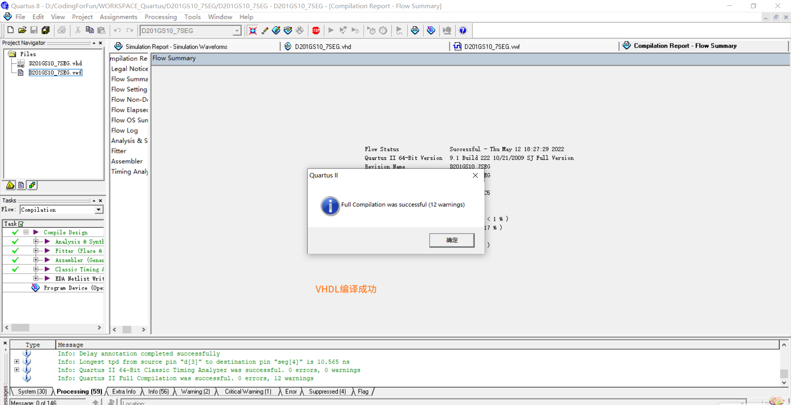
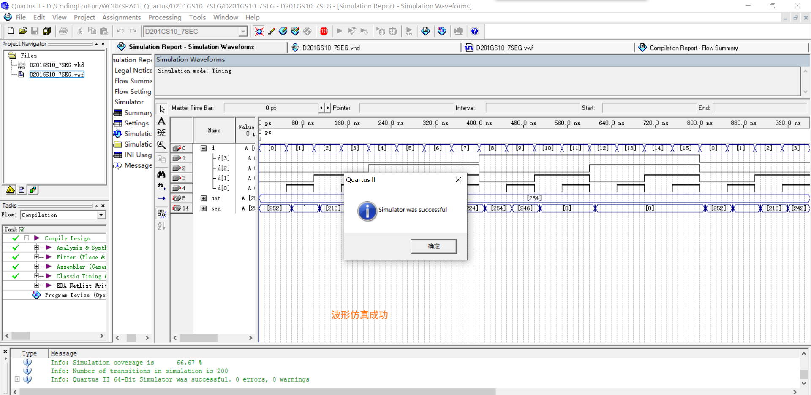
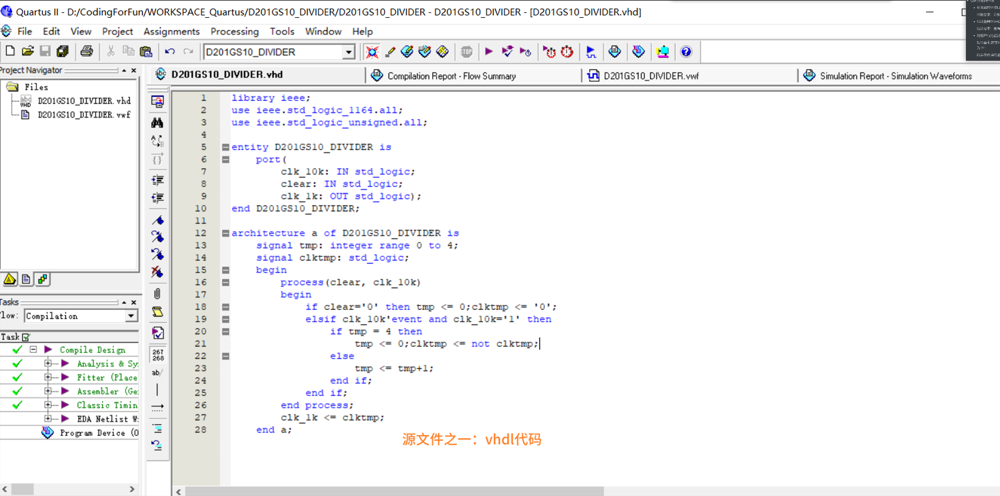
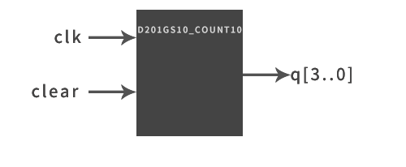
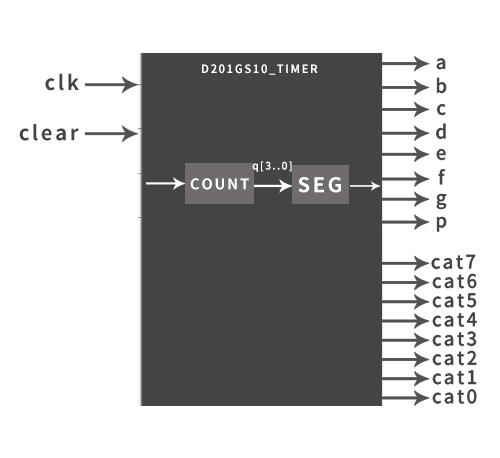
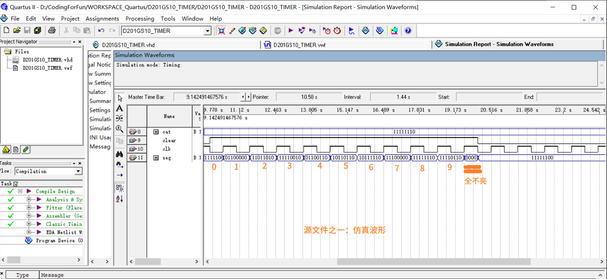

:::tip

该实验报告分为两部分：

* ①组合逻辑电路  

  * **四选一数据选择器**的VHDL设计、编译、仿真  

    功能要求：根据地址端的不同取值选择不同的数据端数据到输出端。

  * 数码管显示译码器的VHDL设计、编译、仿真

    功能要求：在实验板上的一个数码管上实现"0~F"的译码显示。

* ②时序逻辑电路

  * 分频器的VHDL设计、编译、仿真

    功能要求：分频系数为10,分频输出信号占空比为50%

  * 加计数器的VHDL设计、编译、仿真
  
    功能要求：带有异步复位功能,进行8421码十进制循环加计数。  
  
  * 利用已有的设计,用元件例化的方式或多个进程的方式,完成一个秒计时器的设计、编译、仿真  
  
    功能要求:在实验板上的一个数码管上实现“0”-“9”的自动循环显示,每秒切换一个显示数字;显示可以手动复位为“0”；
  
    给定条件:实验板输入时钟为10Hz

:::

#  组合逻辑电路

##  1. 四选一数据选择器

  * ### 真值表：

    d(3)~d(0) | sel(1) | sel(0) | y
    :---: | :---: | :---: | :---: 
    x | 0 | 0 | d(0)
    x | 0 | 1 | d(1) 
    x | 1 | 0 | d(2) 
    x | 1 | 1 | d(3) 
	
  * ### 外观图：

  

  * ### vhdl代码：

  ```vhdl
  LIBRARY ieee;
  USE ieee.std_logic_1164.ALL;
  
  ENTITY D201GS10_DATASELECTOR IS
  PORT(
  	d:IN STD_LOGIC_VECTOR(3 DOWNTO 0);
  	sel:IN STD_LOGIC_VECTOR(1 DOWNTO 0);
  	y:OUT STD_LOGIC
  	);
  END ENTITY D201GS10_DATASELECTOR;	
  
  ARCHITECTURE a OF D201GS10_DATASELECTOR IS
  BEGIN
  	process(d,sel)
  	begin
  		if sel="00" then y<=d(0);
  		elsif sel="01" then y<=d(1);
  		elsif sel="10" then y<=d(2);
  		elsif sel="11" then y<=d(3);
  		else y<='Z';
  		end if;
  	end process;
  END a;
  ```

  * ### 一些工程文件截图：

  

  

  

  

* ### 结果分析：

  根据仿真波形，地址端sel=00时，输出y=d(0)；sel=01时，y=d(1)；sel=10时，y=d(2)；sel=11时，y=d(3).与真值表符合，实现了四选一数据选择。

## 2. 数码管显示译码器

  *  ### 真值表：


  * ### 外观图:

  

  * ### vhdl代码：

  ```vhdl
  LIBRARY ieee;
  USE ieee.std_logic_1164.ALL;
  
  ENTITY D201GS10_7SEG IS
  PORT(
  	d:IN STD_LOGIC_VECTOR(3 DOWNTO 0);
  	cat:OUT STD_LOGIC_VECTOR(7 DOWNTO 0);
  	seg:OUT STD_LOGIC_VECTOR(7 DOWNTO 0));
  END ENTITY D201GS10_7SEG;	
  
  ARCHITECTURE seg7_1_arch OF D201GS10_7SEG IS
  BEGIN
  	cat<="11111110";
  	PROCESS(d)
  	BEGIN
  		CASE d IS
  			WHEN "0000"=> seg <="11111100";--0
  			WHEN "0001"=> seg <="01100000";--1
  			WHEN "0010"=> seg <="11011010";--2
  			WHEN "0011"=> seg <="11110010";--3
  			WHEN "0100"=> seg <="01100110";--4
  			WHEN "0101"=> seg <="10110110";--5
  			WHEN "0110"=> seg <="10111110";--6
  			WHEN "0111"=> seg <="11100000";--7
  			WHEN "1000"=> seg <="11111110";--8
  			WHEN "1001"=> seg <="11110110";--9
  			WHEN OTHERS=> seg <="00000000";
  		END CASE;
  	END PROCESS;
  END;
  ```

  * ### 一些工程文件截图：

  vhdl：

  vhdl编译成功：

  波形仿真成功：

  仿真波形：

  

  * ### 结果分析：

    根据仿真波形，输入d=0时，输出段码seg=11111100，此时数码管显示“0”；d=1时，seg=01100000，此时数码管显示“1”.......忽略延迟，结果与真值表符合，实现了十进制数0~9译码到数码管显示的功能。

  

# 时序逻辑电路

## 3. 分频器

* ### 外观图：


* ### vhdl代码:

```vhdl
library ieee;
use ieee.std_logic_1164.all;
use ieee.std_logic_unsigned.all;

entity D201GS10_DIVIDER is
	port(
		clk_10k: IN std_logic;
		clear: IN std_logic;
		clk_1k: OUT std_logic);
end D201GS10_DIVIDER;

architecture a of D201GS10_DIVIDER is
	signal tmp: integer range 0 to 4;
	signal clktmp: std_logic;
	begin
		process(clear, clk_10k)
		begin
			if clear='0' then tmp <= 0;clktmp <= '0';
			elsif clk_10k'event and clk_10k='1' then
				if tmp = 4 then
					tmp <= 0;clktmp <= not clktmp;
				else
					tmp <= tmp+1;
				end if;
			end if;
		end process;
		clk_1k <= clktmp;
	end a;
```

* ### 一些工程文件截图：

vhdl:



vhdl编译成功：


波形仿真成功：  


仿真波形：  

  

* ###  结果分析

  根据仿真波形，clear=1时，输入信号clk_10k的周期约为100ns，输出clk_1k的周期约为+1460ns - (+460ns) = 1000ns，输出信号的频率是输入信号的1/10。clear=0时，输出恒为0。实现了一个带有异步清零功能的、分频系数为10的分频器。

    

## 4. 加计数器
* ### 外观图：  



* ### vhdl代码：
  ```vhdl
  library ieee;
  use ieee.std_logic_1164.all;
  use ieee.std_logic_unsigned.all;
  
  entity D201GS10_COUNT10 is
  	port(
  	clk,clear: IN std_logic;
  	q: OUT std_logic_vector(3 downto 0)
  	);
  end D201GS10_COUNT10;
  
  architecture a of D201GS10_COUNT10 is
  	signal q_temp: std_logic_vector(3 downto 0);
  	begin process(clk)
  	begin
  		if clear='0' then
  			q_temp <= "0000";
  		elsif(clk'event and clk='1') then
  			if q_temp="1010" then q_temp <= "0000";
  			else 
  				q_temp <= q_temp+1;
  			end if;
  		end if;
  	end process;
  	q <= q_temp;
  	end a;
  ```

  * ### 一些工程文件截图：

    vhdl代码：


​			vhdl编译成功：

	

​		波形仿真成功：


​		仿真波形：


* 结果分析：

  根据仿真波形，clear=1时，计数状态q从“0000\~1010”连续循环变化；clear=0时，q恒为0，实现了带有异步清零功能的、技术状态从“0000~1010”连续变化的加计数器。
  
  
## 5. 秒计时器
* ### 外观图：  

  
  
  * ### vhdl代码：
  
    ```vhdl
    library ieee;
    use ieee.std_logic_1164.all;
    use ieee.std_logic_unsigned.all;
    entity D201GS10_TIMER is
    	port(
    	clk,clear: IN std_logic;
    	cat:OUT STD_LOGIC_VECTOR(7 DOWNTO 0);
    	seg:OUT STD_LOGIC_VECTOR(7 DOWNTO 0));
    end D201GS10_TIMER;
    
    architecture a of D201GS10_TIMER is
    	signal q_temp: std_logic_vector(3 downto 0);
    	signal seg_temp: std_logic_vector(7 downto 0);
    	begin 
    		count:process(clk)
    		begin
    			if clear='0' then
    				q_temp <= "0000";
    			elsif(clk'event and clk='1') then
    				if q_temp="1010" then q_temp <= "0000";
    				else 
    					q_temp <= q_temp+1;
    				end if;
    			end if;
    		end process;
    		
    		MYSEG:process(q_temp)
    		begin
    			CASE q_temp IS
    				WHEN "0000"=> seg_temp <="11111100";--0
    				WHEN "0001"=> seg_temp <="01100000";--1
    				WHEN "0010"=> seg_temp <="11011010";--2
    				WHEN "0011"=> seg_temp <="11110010";--3
    				WHEN "0100"=> seg_temp <="01100110";--4
    				WHEN "0101"=> seg_temp <="10110110";--5
    				WHEN "0110"=> seg_temp <="10111110";--6
    				WHEN "0111"=> seg_temp <="11100000";--7
    				WHEN "1000"=> seg_temp <="11111110";--8
    				WHEN "1001"=> seg_temp <="11110110";--9
    				WHEN OTHERS=> seg_temp <="00000000";
    			END CASE;
    		END PROCESS MYSEG;
    		cat <= "11111110";
    		seg <= seg_temp;
    end a;
    
    ```
  
  * ### 一些工程文件截图
  
      vhdl代码：
  
      
  
      vhdl编译成功：
  
      
  
      波形仿真成功：
  
      
  
      仿真波形：
  
      
  
  * ### 结果分析：
  
      根据仿真波形，clear=1时，输出seg对应的数字从0递增至9；clear=0时，输出seg对应的数字恒为0，实现了带有异步清零（即手动复位）功能、数码管上“0”~“9”自动循环显示、每秒切换一个数字的功能。

