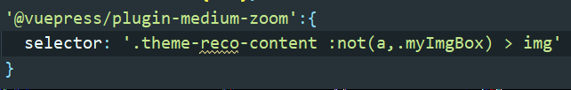

## Error from chokidar (D:\): Error: EBUSY: resource busy or locked, lstat 'D:xxx'

npm run dev之后报错，这里我是因为在某个.md文件中引入了自定义组件，因为这个框架dev时会自动把components目录下的组件自动全局注册，无需我们引入，把该行import去掉就行了。

## 在.md文件中，使用jq动态添加了video标签并含src属性，部署到gitee pages后发现视频资源找不到（404 not found）

首先如果是部署到gitee pages、github page上，需要在config.js中配置base:/'你的仓库名'/。比如我的仓库名是gaosen
::: tip	
我试过如果使用腾讯云静态托管，它的根路径就是它默认给的域名，所以不用配置base，默认的就行

:::
容易发现此src不含/'repo'/.然而我们已经在config.js中配置了base: /'gaosen'/，这是因为jq动态添加的video的src属性在打包后不会自动添加/'repo'/，我的解决方法是jq添加src时就直接写成/gaosen/img/bg.mp4
::: tip

显然这样写src虽然在gitee pages上能正常访问，但在本地测试会404.所以我干脆在public文件夹下新建文件夹gaosen，视频资源放入，则有/gaosen/img/bg.mp4
<br>
更合理的解决方法：[官方文档](https://vuepress.vuejs.org/zh/guide/assets.html#%E5%85%AC%E5%85%B1%E6%96%87%E4%BB%B6)

我一开始没好好看文档，吃亏了...所以希望大家都能好好的看文档

:::

## end of the stream or a document separator is expected at line 3, column 6:

指注意空格

## can not read a block mapping entry; a multiline key may not be an implicit key
冒号后面少了空格

## 自定义组件中禁用图片放大插件
需要这样做：自定义类名"myImgBox"，并在插件的选项中这样配置：

## 项目打包时报错:Error: jQuery requires a window with a document
在stackoverflow上查到：
As Nuxt also renders on the Server you can't use JS that relies on window because on server render it's not available.
Put your jQuery scripts into the mounted() hook. Check this guide  

## 如何二次开发reco主题

### 修改背景色

[reco主题文档](https://vuepress-theme-reco.recoluan.com/views/1.x/customStyleAndScript.html)给出了一些选项，[vuepress文档](https://vuepress.vuejs.org/zh/config/#palette-styl)给出了所有可调整的主题变量。总而言之要新建<code>.vuepress/styles/palette.styl</code>或<code>.vuepress/styles/index.styl</code>  

但在设置背景色过程中发现<code>palette.styl</code>文件中设置的不生效，经过多处寻找，发现网站的根标签html设置了内联样式style，<code>palette.styl</code>被覆盖。为了解决该问题，引入外部js文件，在dom渲染、html被reco主题附加内联样式之后，手动修改其内联样式。如我新建了一个js文件<code>RemoveRecoDark.js</code>:

```javascript
/*修改一些默认reco主题色*/
function adjustRecoColor() {
  let myStyle = `--default-color-10: rgba(0, 0, 0, 1);
    --default-color-9: rgba(0, 0, 0, 0.9);
    --default-color-8: rgba(0, 0, 0, 0.8);
    --default-color-7: rgba(0, 0, 0, 0.7);
    --default-color-6: rgba(0, 0, 0, 0.6);
    --default-color-5: rgba(0, 0, 0, 0.5);
    --default-color-4: rgba(0, 0, 0, 0.4);
    --default-color-3: rgba(0, 0, 0, 0.3);
    --default-color-2: rgba(0, 0, 0, 0.2);
    --default-color-1: rgba(0, 0, 0, 0.1);
    --background-color: #1d2025;
    --box-shadow: 0 1px 4px 0 rgba(0, 0, 0, 0.6);
    --box-shadow-hover: 0 2px 16px 0 rgba(0, 0, 0, 0.7);
    --text-color: rgba(255, 255, 255, 0.8);
    --text-color-sub: #8B8B8B;
    --border-color: rgba(0, 0, 0, 0.3);
    --code-color: rgba(0, 0, 0, 0.3);
    --mask-color: #000;`
  $('html.dark').attr('style',myStyle)
}
/*根据向下滚动举例调整导航栏透明度*/
function adjustHeadBar() {
  $(window).scroll(() => {
    let scrollTop = 80;
    if($(window).scrollTop() > scrollTop) {
      $('header.navbar').attr('style', 'background: var(--background-color);')
    }
    else {
      $('header.navbar').attr('style', 'background: none;')
    }
  })
}

$(document).ready(function(){
  setInterval(() => {
    adjustRecoColor()
  },1000)
  adjustHeadBar()
})
```

上述代码中的myStyle当然不是手打的，而是在浏览器中复制了reco主题html标签的样式，然后只改了其中的<code>--background-color</code>属性值。  

使用定时器<code>setInterval</code>函数，是因为发现当页面路由跳转到/timeline、/category等处时，reco默认的html样式又会重新覆盖我设置的。

### 修改导航栏透明度

在上面贴出的js代码中<code>adjustHeadBar</code>函数就是所求。

上述<code>adjustHeadBar</code>即为所求。关键是<code>\$(window).scroll()、$(window).scrollTop()</code>的使用。

### 设置首页动态背景

嗯，其实就是放一个video标签，关键是找到dom的位置。在工程目录的node_modules下找到<code>vuepress-theme-reco/components/HomeBlog/index.vue</code>，这个文件就是博客首页了，自己~~魔改一番~~。如图：


:::tip

是不是蛮简单的。但是这修改的是reco主题的源码，原则上是不可以修改node_modules下的文件的，你在修改时IDE也会提示你。而且这种修改也不好触发热重载，必须重新<code>npm run dev</code>才会生效。但是我不遵守这个原则。  

当然你可以在首页的README.md中的<code>script</code>标签中动态添加、删除dom元素，以实现想要的效果；而且这是可以触发热重载的。但是这样会使README.md很冗余，编写js代码时不会有自动换行缩进，代码联想补全较少，代码高亮也不如直接的js文件。总之开发体验不是很好。而且我还遇到过一些谜之bug：在本地运行良好，部署到服务器上丢失了某些效果...所以我还是选择动了node_modules。可能有更好的解决办法不修改node_modules，但其实修改node_modules也不是什么罪恶滔天之事，正所谓  
> “不管黑猫白猫，能抓到老鼠的就是好猫。”   

我的评价是：“能实现效果就行。

:::

### 首页打字机效果

同样来到node_modules下的<code>vuepress-theme-reco/components/HomeBlog</code>创建一个<code>ShowFont.vue</code>。  

这个组件就是打字机效果的组件，具体怎么写，可参考[B站教程](https://www.bilibili.com/video/BV1Rz4y1D7Lp?p=24)。这里主要想说的是在什么地方引入使用改组件。很简单，还是在<code>vuepress-theme-reco/components/HomeBlog/index.vue</code>,如图位置：


### vuepress中引入element UI

在<code>docs/.vuepress</code>下新建<code>enhanceApp.js</code>，该文件的一些说明可参考[官方文档](https://vuepress.vuejs.org/zh/guide/basic-config.html#%E5%BA%94%E7%94%A8%E7%BA%A7%E5%88%AB%E7%9A%84%E9%85%8D%E7%BD%AE).  

在该文件中这样写:

```vue
import ElementUI from "element-ui";
import 'element-ui/lib/theme-chalk/index.css'
export default ({
                  Vue, // the version of Vue being used in the VuePress app
                  // options, // the options for the root Vue instance
                  // router, // the router instance for the app
                  // siteData // site metadata
                }) => {
  Vue.use(ElementUI);
}
```

虽然但是，我出现了报错：<code>Cannot find module 'core-js/library/xxx' when import element-ui</code>。[参考文章](https://blog.csdn.net/qq_32855007/article/details/108726430).大概是版本号的问题。需执行<code>yarn add async-validator@1.11.5</code>或<code>npm install async-validator@1.11.5</code>,重新运行就可以了~

## 下次遇到新的坑再更新

