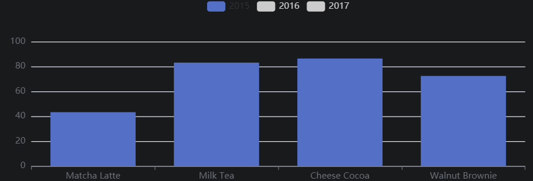
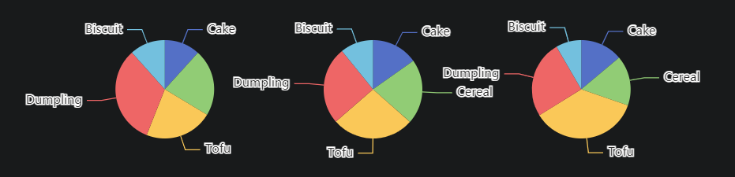
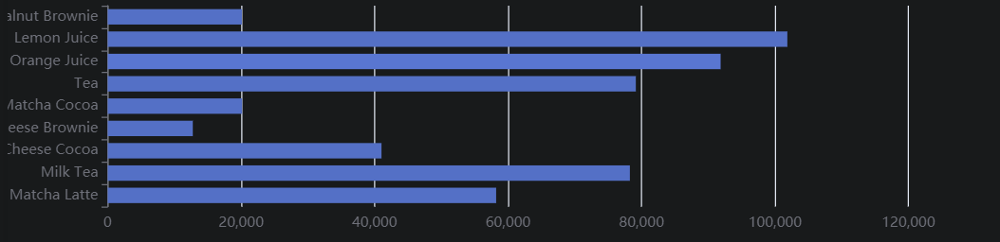

##  监听图表容器的大小并改变图表大小

比如，图表容器是一个高度为 400px、宽度为页面 100% 的节点，你希望在浏览器宽度改变的时候，始终保持图表宽度是页面的 100%。

可以监听页面的 `window.onresize` 事件获取浏览器大小改变的事件，然后调用 [`echartsInstance.resize`](https://echarts.apache.org/api.html#echartsInstance.resize) 改变图表的大小。

```javascript
 var myChart = echarts.init(document.getElementById('main'));
  window.onresize = function() {
    myChart.resize();
  };
```


## 容器节点被销毁以及被重建时

由于图表的容器节点被移除导致的。即使之后该节点被重新添加，图表所在的节点也已经不存在了。

正确的做法是，在图表容器被销毁之后，调用 [`echartsInstance.dispose`](https://echarts.apache.org/api.html#echartsInstance.dispose) 销毁实例，在图表容器重新被添加后再次调用 [echarts.init](https://echarts.apache.org//api.html#echarts.init) 初始化。


## 在数据集中设置数据

``` javascript
option = {
  legend: {},
  tooltip: {},
  dataset: {
    // 提供一份数据。
    source: [
      ['product', '2015', '2016', '2017'],
      ['Matcha Latte', 43.3, 85.8, 93.7],
      ['Milk Tea', 83.1, 73.4, 55.1],
      ['Cheese Cocoa', 86.4, 65.2, 82.5],
      ['Walnut Brownie', 72.4, 53.9, 39.1]
    ]
  },
  // 声明一个 X 轴，类目轴（category）。默认情况下，类目轴对应到 dataset ***第一列***。
  xAxis: { type: 'category' },
  // 声明一个 Y 轴，数值轴。
  yAxis: {},
  // 声明多个 bar 系列，默认情况下，每个系列会自动对应到 dataset 的每一列。
  series: [{ type: 'bar' }, { type: 'bar' }, { type: 'bar' }]
};
```


然而我更喜欢用行分布：
用户可以使用 seriesLayoutBy 配置项，改变图表对于行列的理解。seriesLayoutBy 可取值：

* 'column': 默认值。系列被安放到 dataset 的列上面。
*  'row': 系列被安放到 dataset 的行上面。
```javascript
option = {
  legend: {},
  tooltip: {},
  dataset: {
    source: [
      ['product', '2012', '2013', '2014', '2015'],
      ['Matcha Latte', 41.1, 30.4, 65.1, 53.3],
      ['Milk Tea', 86.5, 92.1, 85.7, 83.1],
      ['Cheese Cocoa', 24.1, 67.2, 79.5, 86.4]
    ]
  },
  xAxis: [
    { type: 'category', gridIndex: 0 },
    { type: 'category', gridIndex: 1 }
  ],
  yAxis: [{ gridIndex: 0 }, { gridIndex: 1 }],
  grid: [{ bottom: '55%' }, { top: '55%' }],
  series: [
    // 这几个系列会出现在第一个直角坐标系中，每个系列对应到 dataset 的每一行。
    { type: 'bar', seriesLayoutBy: 'row' },
    { type: 'bar', seriesLayoutBy: 'row' },
    { type: 'bar', seriesLayoutBy: 'row' },
    // 这几个系列会出现在第二个直角坐标系中，每个系列对应到 dataset 的每一列。
    { type: 'bar', xAxisIndex: 1, yAxisIndex: 1 },
    { type: 'bar', xAxisIndex: 1, yAxisIndex: 1 },
    { type: 'bar', xAxisIndex: 1, yAxisIndex: 1 },
    { type: 'bar', xAxisIndex: 1, yAxisIndex: 1 }
  ]
};
```


## 使用 transform 进行数据转换

::: tip
设置 dataset.transform 
:::

``` js
var option = {
  dataset: [
    {
      // 这个 dataset 的 index 是 `0`。
      source: [
        ['Product', 'Sales', 'Price', 'Year'],
        ['Cake', 123, 32, 2011],
        ['Cereal', 231, 14, 2011],
        ['Tofu', 235, 5, 2011],
        ['Dumpling', 341, 25, 2011],
        ['Biscuit', 122, 29, 2011],
        ['Cake', 143, 30, 2012],
        ['Cereal', 201, 19, 2012],
        ['Tofu', 255, 7, 2012],
        ['Dumpling', 241, 27, 2012],
        ['Biscuit', 102, 34, 2012],
        ['Cake', 153, 28, 2013],
        ['Cereal', 181, 21, 2013],
        ['Tofu', 395, 4, 2013],
        ['Dumpling', 281, 31, 2013],
        ['Biscuit', 92, 39, 2013],
        ['Cake', 223, 29, 2014],
        ['Cereal', 211, 17, 2014],
        ['Tofu', 345, 3, 2014],
        ['Dumpling', 211, 35, 2014],
        ['Biscuit', 72, 24, 2014]
      ]
      // id: 'a'
    },
    {
      // 这个 dataset 的 index 是 `1`。
      // 这个 `transform` 配置，表示，此 dataset 的数据，来自于此 transform 的结果。
      transform: {
        type: 'filter',
        config: { dimension: 'Year', value: 2011 }
      }
      // 我们还可以设置这些可选的属性： `fromDatasetIndex` 或 `fromDatasetId`。
      // 这些属性，指定了，transform 的输入，来自于哪个 dataset。例如，
      // `fromDatasetIndex: 0` 表示输入来自于 index 为 `0` 的 dataset 。又例如，
      // `fromDatasetId: 'a'` 表示输入来自于 `id: 'a'` 的 dataset。
      // 当这些属性都不指定时，默认认为，输入来自于 index 为 `0` 的 dataset 。
    },
    {
      // 这个 dataset 的 index 是 `2`。
      // 同样，这里因为 `fromDatasetIndex` 和 `fromDatasetId` 都没有被指定，
      // 那么输入默认来自于 index 为 `0` 的 dataset 。
      transform: {
        // 这个类型为 "filter" 的 transform 能够遍历并筛选出满足条件的数据项。
        type: 'filter',
        // 每个 transform 如果需要有配置参数的话，都须配置在 `config` 里。
        // 在这个 "filter" transform 中，`config` 用于指定筛选条件。
        // 下面这个筛选条件是：选出维度（ dimension ）'Year' 中值为 2012 的所有
        // 数据项。
        config: { dimension: 'Year', value: 2012 }
      }
    },
    {
      // 这个 dataset 的 index 是 `3`。
      transform: {
        type: 'filter',
        config: { dimension: 'Year', value: 2013 }
      }
    }
  ],
  series: [
    {
      type: 'pie',
      radius: 50,
      center: ['25%', '50%'],
      // 这个饼图系列，引用了 index 为 `1` 的 dataset 。也就是，引用了上述
      // 2011 年那个 "filter" transform 的结果。
      datasetIndex: 1
    },
    {
      type: 'pie',
      radius: 50,
      center: ['50%', '50%'],
      datasetIndex: 2
    },
    {
      type: 'pie',
      radius: 50,
      center: ['75%', '50%'],
      datasetIndex: 3
    }
  ]
};
```

::: tip
按列看
:::


## 维度dimension

* 可以使用单独的 dataset.dimensions 或者 series.dimensions 来定义，这样可以同时指定维度名，和维度的类型（ dimension type ）
* series.dimensions 会更优先于 dataset.dimension 采纳。
个人感觉维度本身不是很重要，主要是为了引出数据到图形的映射(series.encode)。

## 数据到图形的映射(series.encode)
直接看例子:
```js
var option = {
  dataset: {
    source: [
      ['score', 'amount', 'product'],
      [89.3, 58212, 'Matcha Latte'],
      [57.1, 78254, 'Milk Tea'],
      [74.4, 41032, 'Cheese Cocoa'],
      [50.1, 12755, 'Cheese Brownie'],
      [89.7, 20145, 'Matcha Cocoa'],
      [68.1, 79146, 'Tea'],
      [19.6, 91852, 'Orange Juice'],
      [10.6, 101852, 'Lemon Juice'],
      [32.7, 20112, 'Walnut Brownie']
    ]
  },
  xAxis: {},
  yAxis: { type: 'category' },
  series: [
    {
      type: 'bar',
      encode: {
        // 将 "amount" 列映射到 X 轴。
        x: 'amount',
        // 将 "product" 列映射到 Y 轴。
        y: 'product'
      }
    }
  ]
};
```



```js
// 在任何坐标系和系列中，都支持：
encode: {
  // 使用 “名为 product 的维度” 和 “名为 score 的维度” 的值在 tooltip 中显示
  tooltip: ['product', 'score']
  // 使用 “维度 1” 和 “维度 3” 的维度名连起来作为系列名。（有时候名字比较长，这可以避免在 series.name 重复输入这些名字）
  seriesName: [1, 3],
  // 表示使用 “维度2” 中的值作为 id。这在使用 setOption 动态更新数据时有用处，可以使新老数据用 id 对应起来，从而能够产生合适的数据更新动画。
  itemId: 2,
  // 指定数据项的名称使用 “维度3” 在饼图等图表中有用，可以使这个名字显示在图例（legend）中。
  itemName: 3
}

// 直角坐标系（grid/cartesian）特有的属性：
encode: {
  // 把 “维度1”、“维度5”、“名为 score 的维度” 映射到 X 轴：
  x: [1, 5, 'score'],
  // 把“维度0”映射到 Y 轴。
  y: 0
}
```

## 几个常见的 series.encode 设置方式举例

问：如何把第三列设置为 X 轴，第五列设置为 Y 轴？

答：

```js
option = {
  series: {
    // 注意维度序号（dimensionIndex）从 0 开始计数，第三列是 dimensions[2]。
    encode: { x: 2, y: 4 }
    // ...
  }
};
```

问：如何把第三行设置为 X 轴，第五行设置为 Y 轴？

答：

```js
option = {
  series: {
    encode: { x: 2, y: 4 },
    seriesLayoutBy: 'row'
    // ...
  }
};
```

问：数据里没有维度名，那么怎么给出维度名？

答：

```js
var option = {
  dataset: {
    dimensions: ['score', 'amount'],
    source: [
      [89.3, 3371],
      [92.1, 8123],
      [94.4, 1954],
      [85.4, 829]
    ]
  }
};
```


## 应用
::: tip
* 柱状：bar
* 折线：line
* 饼图：pie
使用字符串 '-' 表示空数据

:::
### 动态排序柱状图
```javascript
var data = [];
for (let i = 0; i < 5; ++i) {
  data.push(Math.round(Math.random() * 200));
}

option = {
  xAxis: {
    max: 'dataMax'
  },
  yAxis: {
    type: 'category',
    data: ['A', 'B', 'C', 'D', 'E'],
    inverse: true,
    animationDuration: 300,
    animationDurationUpdate: 300,
    max: 2 // only the largest 3 bars will be displayed
  },
  series: [
    {
      realtimeSort: true,
      name: 'X',
      type: 'bar',
      data: data,
      label: {
        show: true,
        position: 'right',
        valueAnimation: true
      }
    }
  ],
  legend: {
    show: true
  },
  animationDuration: 3000,
  animationDurationUpdate: 3000,
  animationEasing: 'linear',
  animationEasingUpdate: 'linear'
};

function update() {
  var data = option.series[0].data;
  for (var i = 0; i < data.length; ++i) {
    if (Math.random() > 0.9) {
      data[i] += Math.round(Math.random() * 2000);
    } else {
      data[i] += Math.round(Math.random() * 200);
    }
  }
  myChart.setOption(option);
}

setInterval(function() {
  update();
}, 3000);
```


### 阶梯线图
```javascript
option = {
  xAxis: {
    type: 'category',
    data: ['Mon', 'Tue', 'Wed', 'Thu', 'Fri', 'Sat', 'Sun']
  },
  yAxis: {
    type: 'value'
  },
  series: [
    {
      name: 'Step Start',
      type: 'line',
      step: 'start',
      data: [120, 132, 101, 134, 90, 230, 210]
    },
    {
      name: 'Step Middle',
      type: 'line',
      step: 'middle',
      data: [220, 282, 201, 234, 290, 430, 410]
    },
    {
      name: 'Step End',
      type: 'line',
      step: 'end',
      data: [450, 432, 401, 454, 590, 530, 510]
    }
  ]
};
```


