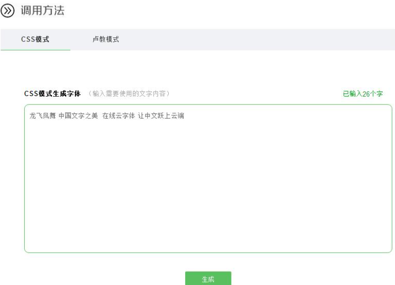
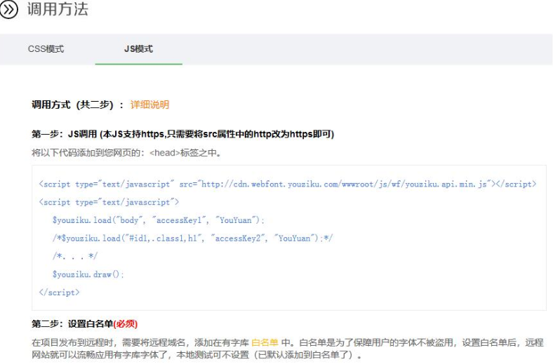
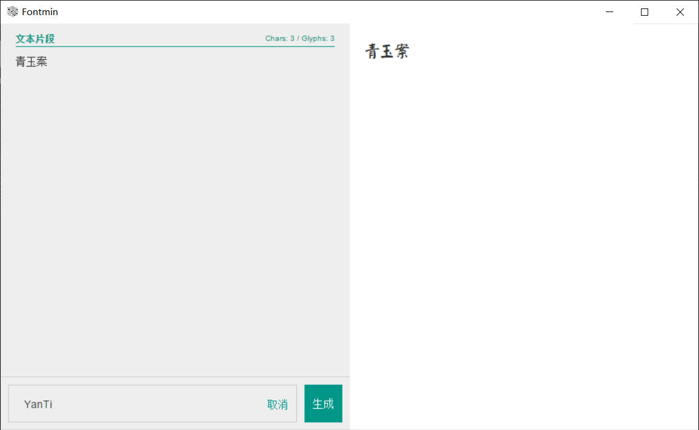

有时我们的项目会使用到一些特殊的字体，英文字体还好说，一般比较小，中文字体动辄几MB甚至十几MB，如果直接把中文字体的ttf格式文件放到项目中会很影响网页的加载速度。有什么办法可以使项目中引用的字体文件变小呢？

## 1.[有字库](https://www.webfont.com/)

典型的webfont，免安装、免下载、直接在线使用。它的优点是非常简单，有两种引用模式：

* css模式

  

  输入需要的文字，点击生成，自动跳转到CSS引用结果界面，会告诉你具体怎么引用

  

* js模式

  

  ## 2.[字蛛](https://github.com/aui/font-spider)

  第一种方案是最简单的，但是也有缺点：**付费**。当然一般新用户会有点免费额度，不过基本上调用几次就用完了。我就是用着用着发现自己的网站的字体失效了，非常难受。

  字蛛的原理是爬取html文件中的字体，然后生成新的字体文件，新的字体文件中不含未使用的字，所以减小了体积。  

  然而字蛛对静态网页友好，对我的vue项目很不友好。特别是它只支持html格式，尝试了一番后我最后放弃了。

  话说字蛛官网好像重定向到了某个不可名状的网站，蛮怪的.jpg。所以上面的链接是github地址。

  ## 3.最终方案：[Fontmin](http://ecomfe.github.io/fontmin/#banner)

  我直接下载了桌面版，非常香，可以直接生成只含所需文字的字体文件，使几十MB的字体文件减小到几kb

  

点击生成后会得到如下文件

然后就可以把这些文件拿去项目中引用了~

::: tip

顺便分享两个有关字体的网站：  

字体下载：[字体天下](https://www.fonts.net.cn/me/downloads-1.html)  

可进行相关字体格式的转换：[文件转换](https://convertio.co/zh/)  

:::