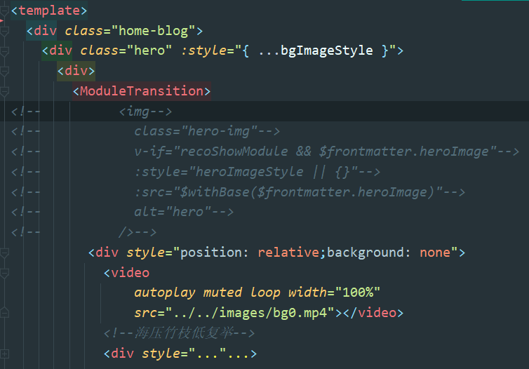
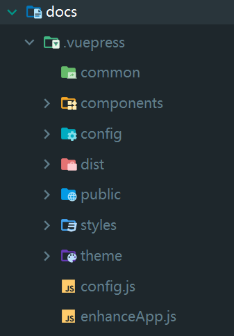
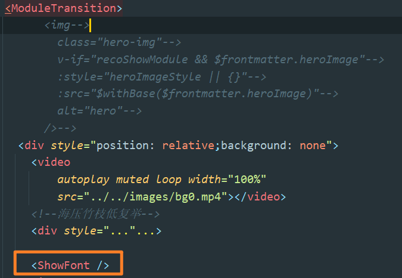
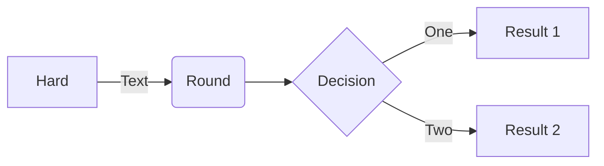
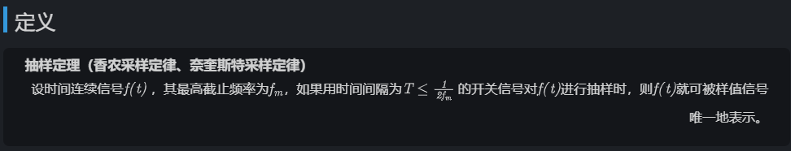

## 修改背景色

[reco主题文档](https://vuepress-theme-reco.recoluan.com/views/1.x/customStyleAndScript.html)给出了一些选项，[vuepress文档](https://vuepress.vuejs.org/zh/config/#palette-styl)给出了所有可调整的主题变量。总而言之要新建<code>.vuepress/styles/palette.styl</code>或<code>.vuepress/styles/index.styl</code>  

但在设置背景色过程中发现<code>palette.styl</code>文件中设置的不生效，经过多处寻找，发现网站的根标签html设置了内联样式style，<code>palette.styl</code>被覆盖。为了解决该问题，引入外部js文件，在dom渲染、html被reco主题附加内联样式之后，手动修改其内联样式。如我新建了一个js文件<code>RemoveRecoDark.js</code>:

```javascript
/*修改一些默认reco主题色*/
function adjustRecoColor() {
  let myStyle = `--default-color-10: rgba(0, 0, 0, 1);
    --default-color-9: rgba(0, 0, 0, 0.9);
    --default-color-8: rgba(0, 0, 0, 0.8);
    --default-color-7: rgba(0, 0, 0, 0.7);
    --default-color-6: rgba(0, 0, 0, 0.6);
    --default-color-5: rgba(0, 0, 0, 0.5);
    --default-color-4: rgba(0, 0, 0, 0.4);
    --default-color-3: rgba(0, 0, 0, 0.3);
    --default-color-2: rgba(0, 0, 0, 0.2);
    --default-color-1: rgba(0, 0, 0, 0.1);
    --background-color: #1d2025;
    --box-shadow: 0 1px 4px 0 rgba(0, 0, 0, 0.6);
    --box-shadow-hover: 0 2px 16px 0 rgba(0, 0, 0, 0.7);
    --text-color: rgba(255, 255, 255, 0.8);
    --text-color-sub: #8B8B8B;
    --border-color: rgba(0, 0, 0, 0.3);
    --code-color: rgba(0, 0, 0, 0.3);
    --mask-color: #000;`
  $('html.dark').attr('style',myStyle)
}
/*根据向下滚动举例调整导航栏透明度*/
function adjustHeadBar() {
  $(window).scroll(() => {
    let scrollTop = 80;
    if($(window).scrollTop() > scrollTop) {
      $('header.navbar').attr('style', 'background: var(--background-color);')
    }
    else {
      $('header.navbar').attr('style', 'background: none;')
    }
  })
}

$(document).ready(function(){
  setInterval(() => {
    adjustRecoColor()
  },1000)
  adjustHeadBar()
})
```

上述代码中的myStyle当然不是手打的，而是在浏览器中复制了reco主题html标签的样式，然后只改了其中的<code>--background-color</code>属性值。  

使用定时器<code>setInterval</code>函数，是因为发现当页面路由跳转到/timeline、/category等处时，reco默认的html样式又会重新覆盖我设置的。

## 修改导航栏透明度

在上面贴出的js代码中<code>adjustHeadBar</code>函数就是所求。

上述<code>adjustHeadBar</code>即为所求。关键是<code>\$(window).scroll()、$(window).scrollTop()</code>的使用。

## 设置首页动态背景

嗯，其实就是放一个video标签，关键是找到dom的位置。在工程目录的node_modules下找到<code>vuepress-theme-reco/components/HomeBlog/index.vue</code>，这个文件就是博客首页了，自己~~魔改一番~~。如图：



:::tip 提示

是不是蛮简单的。但是这修改的是reco主题的源码，原则上是不可以修改node_modules下的文件的，你在修改时IDE也会提示你。而且这种修改也不好触发热重载，必须重新<code>npm run dev</code>才会生效。但是我在这我说了算:laughing:。  

:::

当然你可以在首页的README.md中的<code>script</code>标签中动态添加、删除dom元素，以实现想要的效果；而且这是可以触发热重载的。但是这样会使README.md很冗余，编写js代码时不会有自动换行缩进，代码联想补全较少，代码高亮也不如直接的js文件。总之开发体验不是很好。而且我还遇到过一些谜之bug：在本地运行良好，部署到服务器上丢失了某些效果...所以我还是选择动了node_modules。可能有更好的解决办法不修改node_modules，但其实修改node_modules也不是什么罪恶滔天之事，正所谓  
> “不管黑猫白猫，能抓到老鼠的就是好猫。”   

我的评价是：“能实现效果就行”。:yum:


---

## 后续更新：关于修改颜色的终极方案

上述做法虽然能达到效果，但是感觉不合常理、不优雅、蛮丑陋的:frowning:。在我参考了一篇关于[设计黑暗/亮色模式的博客](https://blog.csdn.net/jaykm/article/details/106214527)以及[其他人的vuepress开源库](https://github.com/zpj80231/znote)之后，以下的做法更加优雅（嗯而且可以触发触发热重载:yum:）  

来到node_modules下的<code>vuepress-theme-reco</code>,直接拷贝到<code>docs/.vuepress</code>，且更名为<code>theme</code>.此时的文件夹目录如图：  



然后去到<code>theme/components/Mode/modeOptions.js</code>里修改它的颜色变量，该文件内容大致如下：

```js
const modeOptions = {
  light: {
    '--default-color-10': 'rgba(255, 255, 255, 1)',
    '--default-color-9': 'rgba(255, 255, 255, .9)',
    '--default-color-8': 'rgba(255, 255, 255, .8)',
    '--default-color-7': 'rgba(255, 255, 255, .7)',
    '--default-color-6': 'rgba(255, 255, 255, .6)',
     /* ...... */
  }
  dark: {
    '--default-color-10': 'rgba(29, 32, 37, 1)',
    '--default-color-9': 'rgba(29, 32, 37, .9)',
    '--default-color-8': 'rgba(29, 32, 37, .8)',
    '--default-color-7': 'rgba(29, 32, 37, .7)',
    '--default-color-6': 'rgba(29, 32, 37, .6)',
    /* ...... */
	}
}
```

然后修改里面的颜色值就可以触发热重载改变一些reco主题的颜色。而且在浏览器中根据vue-tools快速找到页面内容对应的组件后，就可以在该<code>components</code>目录下自己修改任何reco主题的组件了~

比如我修改了导航栏一开始是透明的，滚动条下移80px后才不透明：  

在<code>docs/.vuepress/theme/components/Navbar.vue</code>里简单自己写了一个函数：

```js
function adjustHeadBar() {
      $(window).scroll(() => {
        let scrollTop = 80;
        if($(window).scrollTop() > scrollTop) {
          $('header.navbar').attr('style', 'background: var(--background-color);')
        }
        else {
          $('header.navbar').attr('style', 'background: none;')
        }
      })
    }
    adjustHeadBar()
```

::: warning

现在这种做法既可以触发热重载，又不修改作者的源码，比起之前直接修改node_modules下文件的做法要优雅。但是这同样意味着不能更新作者的代码(而之前的做法由于只是增添了脚本，而且脚本只是关于主题颜色中的几个颜色，影响不大)。不过博主当前的使用版本应该是1.x中的最新了，更新版的在2.x了，作者似乎也没有写迁移文档呢，难道是不能迁移？

:::


## 首页打字机效果

~~同样来到node_modules下的<code>vuepress-theme-reco/components/HomeBlog</code>创建一个<code>ShowFont.vue</code>。~~

<code>docs/.vuepress/theme/components/HomeBlog/ShowFont.vue</code>

这个组件就是打字机效果的组件，具体怎么写，可参考[B站教程](https://www.bilibili.com/video/BV1Rz4y1D7Lp?p=24)。~~这里主要想说的是在什么地方引入使用改组件。很简单，还是在<code>vuepress-theme-reco/components/HomeBlog/index.vue</code>~~ 在<code>docs/.vuepress/theme/components/HomeBlog/index.vue</code>的如图位置引用:



## vuepress中引入element UI

在<code>docs/.vuepress</code>下新建<code>enhanceApp.js</code>，该文件的一些说明可参考[官方文档](https://vuepress.vuejs.org/zh/guide/basic-config.html#%E5%BA%94%E7%94%A8%E7%BA%A7%E5%88%AB%E7%9A%84%E9%85%8D%E7%BD%AE).  

在该文件中这样写:

```vue
import ElementUI from "element-ui";
import 'element-ui/lib/theme-chalk/index.css'
export default ({
                  Vue, // the version of Vue being used in the VuePress app
                  // options, // the options for the root Vue instance
                  // router, // the router instance for the app
                  // siteData // site metadata
                }) => {
  Vue.use(ElementUI);
}
```

虽然但是，我出现了报错：<code>Cannot find module 'core-js/library/xxx' when import element-ui</code>。[参考文章](https://blog.csdn.net/qq_32855007/article/details/108726430).大概是版本号的问题。需执行<code>yarn add async-validator@1.11.5</code>或<code>npm install async-validator@1.11.5</code>,重新运行就可以了~

虽然但是，这些组件没有适配移动端，以下给出几个组件的适配代码：

在<code>docs/.vuepress/styles/index.styl</code>中：

```css
/*弹窗*/
@media screen and (max-width: 500px) {
  .el-message {
    min-width: 300px !important;
  }
}
@media screen and (max-width: 500px) {
  .el-message-box{
    width: 300px !important;
  }
}
```


## 引入[mermaid](https://github.com/mermaid-js/mermaid)

* npm i mermaid
* npm i vuepress-plugin-mermaidjs

::: tip

一定要两个都下载！其中mermaidjs是插件要在config.js中填入。如果不装mermaid会报错can not find mermaid之类的，我也不知这个插件为什么没有集成mermaid，难道是为了体量..？具体说明在其[文档](https://vuepress-plugin-mermaidjs.efrane.com/)。

:face_with_head_bandage:找了半天的官方文档，最后在npm的github链接处找到了。我真是个笨蛋，npm逛了那么久都没注意，以为如果[npm](https://www.npmjs.com/package/vuepress-plugin-mermaidjs)处没有文档说明就没有了，毕竟好多插件都这样。。。

效果：




还有一种用法顺嘴一说（不感兴趣的跳过）：

下载<code>npm i mermaid</code>,在<code>docs/.vuepress/enhanceApp.js</code>下引入并初始化：

```js
import Mermaid from 'mermaid'
Mermaid.initialize({startOnLoad:true});
```

在markdown文件或一般的html中这样使用:

```html
<div class="mermaid">
flowchart LR

A[Hard] -->|Text| B(Round)
B --> C{Decision}
C -->|One| D[Result 1]
C -->|Two| E[Result 2]
</div>
```

我使用这种方法的时候，第一次进入页面时流程图没有渲染，要刷新后才能渲染，而且切换路由后又会变回原样，试了很多次都这样，我甚至参考了mermaid提供的[API](https://mermaid-js.github.io/mermaid/#/usage?id=api-usage),自己编写了渲染函数，试来试去都没用啊，我想啸啊:face_with_head_bandage:。一度想在它的github开源库上提issue。。


## 引入mathjax

<code>npm i markdown-it-mathjax3</code>,在<code>docs/.vuepress/config.js</code>中引入、使用：

```js
const mathjax3 = require('markdown-it-mathjax3');

/*...*/

markdown: {
    lineNumbers: true,
    extendMarkdown: md => {
      md.use(mathjax3);
    }
  },
```

这样在typro中键入的数学公式就可以正常渲染了，如图

