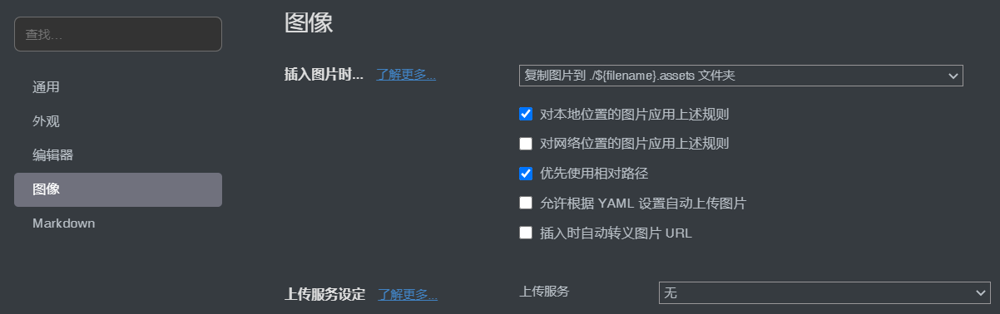

## Error from chokidar (D:\): Error: EBUSY: resource busy or locked, lstat 'D:xxx'

npm run dev之后报错，这里我是因为在某个.md文件中引入了自定义组件，因为这个框架dev时会自动把components目录下的组件自动全局注册，无需我们引入，把该行import去掉就行了。

## 在.md文件中，使用jq动态添加了video标签并含src属性，部署到gitee pages后发现视频资源找不到（404 not found）

首先如果是部署到gitee pages、github page上，需要在config.js中配置base:/'你的仓库名'/。比如我的仓库名是gaosen
::: tip	
我试过如果使用腾讯云静态托管，它的根路径就是它默认给的域名，所以不用配置base，默认的就行

:::
容易发现此src不含/'repo'/.然而我们已经在config.js中配置了base: /'gaosen'/，这是因为jq动态添加的video的src属性在打包后不会自动添加/'repo'/，我的解决方法是jq添加src时就直接写成/gaosen/img/bg.mp4
::: tip

显然这样写src虽然在gitee pages上能正常访问，但在本地测试会404.所以我干脆在public文件夹下新建文件夹gaosen，视频资源放入，则有/gaosen/img/bg.mp4
<br>
更合理的解决方法：[官方文档](https://vuepress.vuejs.org/zh/guide/assets.html#%E5%85%AC%E5%85%B1%E6%96%87%E4%BB%B6)

我一开始没好好看文档，吃亏了...所以希望大家都能好好的看文档

:::

## end of the stream or a document separator is expected at line 3, column 6:

指注意空格

## can not read a block mapping entry; a multiline key may not be an implicit key
冒号后面少了空格

## 自定义组件中禁用图片放大插件
需要这样做：自定义类名"myImgBox"，并在插件的选项中这样配置：

## 项目打包时报错:Error: jQuery requires a window with a document
在stackoverflow上查到：
As Nuxt also renders on the Server you can't use JS that relies on window because on server render it's not available.
Put your jQuery scripts into the mounted() hook. Check this guide  

## Vuepress 图片资源中文路径问题
参考[博客]([Vuepress 图片资源中文路径问题](https://segmentfault.com/a/1190000022275001))

::: tip

使用 [Typora](https://link.segmentfault.com/?enc=HJcBEGQavzeCLEyorJA4QA%3D%3D.mmarSRpO3oNjabIHOXBN%2FQ%3D%3D) 编写 Markdown 文件，其中的图片路径含中文时，不能被正常编译

:::

1. 首先，typro设置成这样：



2. 安装 `markdown-it-disable-url-encode`

   <code>npm i markdown-it-disable-url-encode</code>

3. <code>.vuepress/config.js</code>

```js
module.exports = {
  // .....
  markdown: {
    // ......
    extendMarkdown: md => {
      md.use(require("markdown-it-disable-url-encode"));
    }
  }
};
```

这样Typora 编写的含中文路径的图片资源的 markdown 文件就可以在`vuepress`中完美编译，可以一心写文档了。


## 下次遇到新的坑再更新

